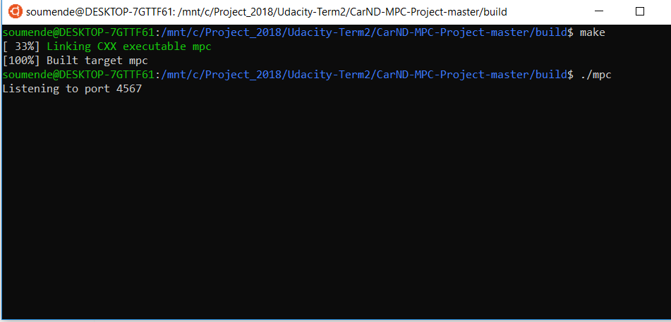

# CarND-MPC-Project-P5
Udacity Self-Driving Car Nanodegree - Model Predictive Control (MPC) Project

# Overview

This project implements a [Model Predictive Controller(MPC)](https://en.wikipedia.org/wiki/Model_predictive_control) to control a car in Udacity's simulator([it could be downloaded here](https://github.com/udacity/self-driving-car-sim/releases)). The simulator sends car telemetry information (the data specifications are [here](./DATA.md)) to the MPC using [WebSocket](https://en.wikipedia.org/wiki/WebSocket) and it receives the steering angle and throttle. The MPC uses the [uWebSockets](https://github.com/uNetworking/uWebSockets) WebSocket implementation to handle this communication. Udacity provides a seed project to start from on this project ([here](https://github.com/udacity/CarND-MPC-Project)).


## Dependencies

* cmake >= 3.5
 * All OSes: [click here for installation instructions](https://cmake.org/install/)
* make >= 4.1(mac, linux), 3.81(Windows)
  * Linux: make is installed by default on most Linux distros
  * Mac: [install Xcode command line tools to get make](https://developer.apple.com/xcode/features/)
  * Windows: [Click here for installation instructions](http://gnuwin32.sourceforge.net/packages/make.htm)
* gcc/g++ >= 5.4
  * Linux: gcc / g++ is installed by default on most Linux distros
  * Mac: same deal as make - [install Xcode command line tools]((https://developer.apple.com/xcode/features/)
  * Windows: recommend using [MinGW](http://www.mingw.org/)
* [uWebSockets](https://github.com/uWebSockets/uWebSockets)
  * Run either `install-mac.sh` or `install-ubuntu.sh`.
  * If you install from source, checkout to commit `e94b6e1`, i.e.
    ```
    git clone https://github.com/uWebSockets/uWebSockets
    cd uWebSockets
    git checkout e94b6e1
    ```
    Some function signatures have changed in v0.14.x. See [this PR](https://github.com/udacity/CarND-MPC-Project/pull/3) for more details.

* **Ipopt and CppAD:** Please refer to [this document](https://github.com/udacity/CarND-MPC-Project/blob/master/install_Ipopt_CppAD.md) for installation instructions.
* [Eigen](http://eigen.tuxfamily.org/index.php?title=Main_Page). This is already part of the repo so you shouldn't have to worry about it.
* Simulator. You can download these from the [releases tab](https://github.com/udacity/self-driving-car-sim/releases).
* Not a dependency but read the [DATA.md](./DATA.md) for a description of the data sent back from the simulator.


## Basic Build Instructions

1. Clone this repo.
2. Make a build directory: `mkdir build && cd build`
3. Compile: `cmake .. && make`
4. Run it: `./mpc`.


# [Rubic](https://review.udacity.com/#!/rubrics/896/view) points

## Compilation

### Your code should compile.

The code compiles without errors or warnings. No modifications were done on the provided setup.

-

## Implementation

### The Model

  The motion model in this project was based on the [Kinematic equations of motion]
    
  The state consists of following parameters:
    1. The x coordinate of position of car in vehicle's coordinate system (x)
    2. The y coordinate of position of car in vehicle's coordinate system (y)
    3. The heading direction of car in vehicle's coordinate system (psi)
    4. The magnitude of velocity of car (v)
    
  The actuator inputs used to control the car are given below:
    1. The magnitude of steering (delta). This was limited to [-25, 25] as per the angle specification of simulator.
    2. The magnitude of throttle (a). This was limited to [-1, 1] as per the throttle/brake specification of simulator.
    

The model used is a simplified model and ignores the complex interactions between the tires and the road. The model equations are as follow:

```
x[t] = x[t-1] + v[t-1] * cos(psi[t-1]) * dt
y[t] = y[t-1] + v[t-1] * sin(psi[t-1]) * dt
psi[t] = psi[t-1] + v[t-1] / Lf * delta[t-1] * dt
v[t] = v[t-1] + a[t-1] * dt
cte[t] = f(x[t-1]) - y[t-1] + v[t-1] * sin(epsi[t-1]) * dt
epsi[t] = psi[t] - psides[t-1] + v[t-1] * delta[t-1] / Lf * dt
```

Where:

- `x, y` : Car's position.
- `psi` : Car's heading direction.
- `v` : Car's velocity.
- `cte` : Cross-track error.
- `epsi` : Orientation error.

Those values are considered the state of the model.

 `Lf` is the distance between the center of mass and the front wheels. 
 
 The other two values are the model output:

- `a` : Car's acceleration (throttle).
- `delta` : Steering angle.

The objective of this project is to find the acceleration (`a`) and the steering angle(`delta`) in the way it will minimize an objective function that is the combination of different factors:

- Square sum of `cte` and `epsi`. It could be found [here](./src/MPC.cpp#L55).
- Square sum of the difference actuators to penalize a lot of actuator's actions. It could be found [here](./src/MPC.cpp#L62).
- Square sum of the difference between two consecutive actuator values to penalize sharp changes. It could be found [here](./src/MPC.cpp#L69).

How much weight each of these factors had were tuned manually to obtain a successful track ride without leaving the road.

### Timestep Length and Elapsed Duration (N & dt)

  Given the reference trajectory from polynomial fit of waypoints and the motion model of the car, MPC estimates the value of actuator inputs for current time step and few time steps later. This estimate is used to predict the actuator inputs to the car ahead of time. This process of estimate generation is tunable with the use of N and dt. Higher value of N ensures more number of estimates while higher value of dt ensures the estimates are closer in time.
  Different combinations of values of N and dt were tried and following were the obervations:
    
        N and dt            Observation/Effect
        
        N = 10, dt = 0.1	  Sharp turns as less number of discrete points between subsequent states
        N = 20, dt = 0.1	  Estimate too ahead of time resulting in slower implementation of algorithm
        N = 10, dt = 0.05	  Too close estimates resulting in oscillation of car at slow speeds
        N = 7, dt = 0.07	  Perfect combination for motion of car

  After trial and error, a setting of **N = 7** and **dt = 0.07 (sec)** was used to predict actuator inputs and the trajectory of car for roughly next 500ms. MPC implementation generates the coordinates and heading of car for next 500ms and is drawn inside the simulator using green curve as shown below:
    


### Polynomial Fitting and MPC Preprocessing

The waypoints provided by the simulator are transformed to the car coordinate system at [./src/main.cpp](./src/main.cpp#L104) from line 104 to line 113. Then a 3rd-degree polynomial is fitted to the transformed waypoints. These polynomial coefficients are used to calculate the `cte` and `epsi` later on. They are used by the solver as well to create a reference trajectory.

### Model Predictive Control with Latency

To handle actuator latency, the state values are calculated using the model and the delay interval. To take into account the effect of this latency, the state parameters for next state were calculated beforehand and were sent to MPC for generating steering and throttle values. This ensured the actuations applied at current point of time were actually for the next time step (i.e. after 100 ms). This small update in state calculation solved the problem of latency and the car was back on track w.r.t. its desired behavior.

## Simulation 

### The vehicle must successfully drive a lap around the track.

MPC used to derive the steering angles and throttle/brake for a car moving on a circular track was implemented successfully. The car could stay close to the center of the lane and take smooth left and right turns along its path while reaching speeds as high as 97mph. This was achieved in spite of presence of latency in the system. This is demonstrated below:


